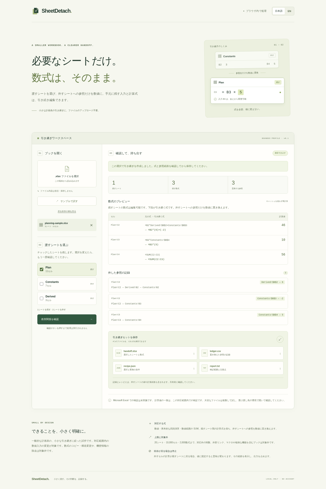
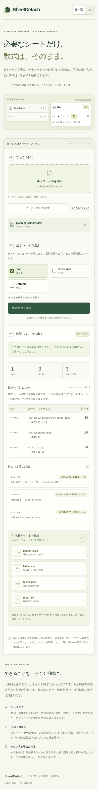
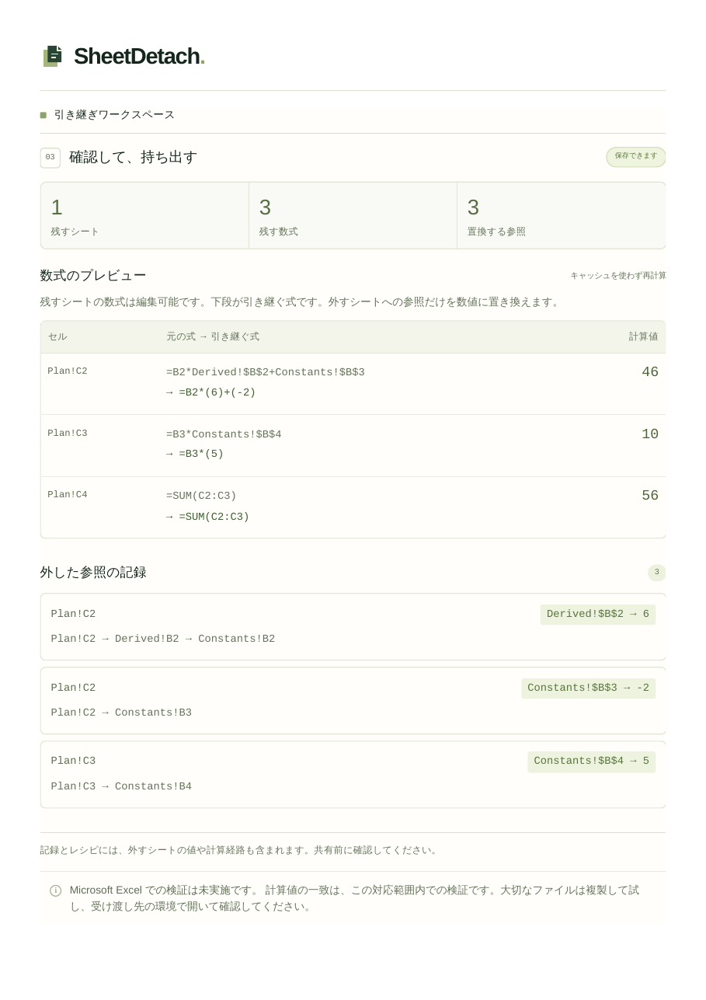

# SheetDetach

Keep a small planning workbook editable when handing off only selected sheets.

SheetDetach replaces only scalar references to omitted sheets with recomputed
numeric literals. Inputs and formulas within retained sheets stay live. It runs
locally in a browser, without a server, account or file upload.

**Prototype scope:** plain, bounded XLSX planning templates. This is not a general
Excel converter, financial-model validator, or confidential-data scrubber.
Microsoft Excel-native behavior is unverified.

## Try the standalone app

Open `dist/index.html`, choose **サンプルで試す / Try sample**, keep `Plan`, then
choose **依存関係を確認 / Check dependencies**. Review the formula changes and
save the four files individually:

- `handoff.xlsx`: retained worksheets with live formulas
- `ledger.csv`: each frozen reference occurrence, original/replacement formula,
  numeric value, and dependency lineage
- `recipe.json`: selection, profile, formulas, frozen values and validation limits
- `report.txt`: readable scope and formula summary

The sample starts with results **46, 10, 56**. In the exported workbook, changing
`Plan!B2` from 8 to 10 and `Plan!B3` from 2 to 3 should recalculate to
**58, 15, 73** in a supported spreadsheet consumer. The linked hosted run verified both states in LibreOffice 7.3.7.2 after
native recalculation, save and reopen; Microsoft Excel remains unverified.

The ledger and recipe deliberately include values and lineage from omitted
sheets. Review them before sharing. The workbook preserves shared styles and
optional theme definitions; it is not a redaction tool.

## The dependency guard

A source workbook can be acyclic while its selected-sheet boundary is unsafe:

`Plan!C2 → Derived!B2 → Plan!B2`

Freezing `Derived!B2` would break future responses to edits in retained `Plan`.
SheetDetach blocks export and shows this exact path. Keeping `Derived` resolves
that boundary without flattening an entire result cell. The second sample
exposes this case.

## Supported profile

- One transitional `.xlsx`, at most 8 MiB compressed / 32 MiB expanded,
  100 ZIP entries, 20 visible sheets, 10,000 occupied cells, 2,000 formula cells
- At most 500,000 formula characters total, 8,192 per formula, 128 nested primary
  expressions, 100,000 unique dependency edges and expanded reference visits, 10,000 cells per SUM range
- 100,000 lineage visits, 50,000 evidence nodes/path cells and 8,388,608 serialized
  ledger characters; 10,000 row and 1,000 column declarations per workbook
- XML 1.0 UTF-8 only, maximum depth 64 and 100,000 elements per XML part;
  1,000 entries per style container and one sheet view per sheet
- Finite numeric inputs and static plain-text labels
- `+ - * /`, unary signs, parentheses, scalar A1 references, `$` anchors, quoted
  sheet names including escaped apostrophes, and `SUM`
- SUM ranges in retained formulas must stay entirely on retained sheets; an
  omitted calculation may use a supported numeric range before being frozen
- Basic cell styles, supported standard DrawingML themes, number formats, row/column dimensions, merges, supported
  sheet views/panes and simple print layout are preserved

Source formula caches are ignored. All formula cells are checked, including
unselected sheets. Blank, text, boolean and date operands, cycles, division by
zero, non-finite results, external links, defined names, tables, charts, macros,
pivots, drawings, rich text, hidden sheets, conditional formatting, validation,
shared/array formulas, unsupported functions and boundary ranges are rejected.

Calculations use IEEE-754 binary64 with absolute values no larger than 1e100.
Spreadsheet engines can differ in rounding and significant-digit handling;
this prototype provides no exact-decimal or financial precision guarantee.
The equivalence contract covers supported numeric input edits on kept sheets,
with omitted independent inputs fixed. Formula fill, structural edits and
changes to omitted sheets are outside that contract.

## Development and checks

Node 22 or 24 and Python 3.12 are the hosted test targets.

```
npm ci --ignore-scripts
python -m pip install -r requirements.txt
npm run check
npm run fixture
npm run test:oracle
python tools/libreoffice.py --validate
npm run serve
```

`npm run test:browser` launches sandboxed Chromium. The native test requires a
GitHub-hosted Linux runner and uses the actual browser-downloaded XLSX, with
fresh LibreOffice profiles for recalculation and 12 input states. It has no
local launch or generated-fixture fallback. Do not add `--no-sandbox`.

[Verified hosted run](https://github.com/Masanori-Spec/sheet-detach/actions/runs/37215341186) passed all three jobs at commit
`af79b6f78f6f0d5000afb452348e7f4d23f16218`:
132 tests on Node 22 and 24; independent ZIP/openpyxl checks over 12 states and
8 damaged-export rejections; 15 sandboxed browser checks; actual-download
validation; and **26 LibreOffice 7.3.7.2 conversions** across initial and 12
input-change states with fresh-profile save/reopen. All six JA/EN desktop/mobile
and guard screenshots, plus both two-page A4 print PDFs, were visually inspected.

See [consumer validation](docs/consumer-validation.md) and
[verification evidence](docs/VERIFICATION.md) for exact scope and limitations.
The native harness uses LibreOffice's display-independent SVP backend. No browser
sandbox bypass is used. Workflow execution remains subject to the repository
owner's existing GitHub limits.

### Actual screenshots

Synthetic planning fixture from the linked passing run:



<details><summary>Japanese mobile layout at 390px</summary>



</details>

[Japanese print PDF](docs/evidence/hosted/handoff-review-ja.pdf) ·
[English print PDF](docs/evidence/hosted/handoff-review-en.pdf)



## Research and boundaries

[Prior-art comparison](docs/PRIOR_ART.md) distinguishes this narrow workflow from
existing sheet export and manual partial formula freezing. No novelty, patent,
market-demand or time-saved claim is made.

[Algorithm](docs/ALGORITHM.md) · [Security](docs/SECURITY.md) ·
[Third-party notices](docs/THIRD_PARTY.md)

No new project license is assigned. Dependency notices remain in the repository.
